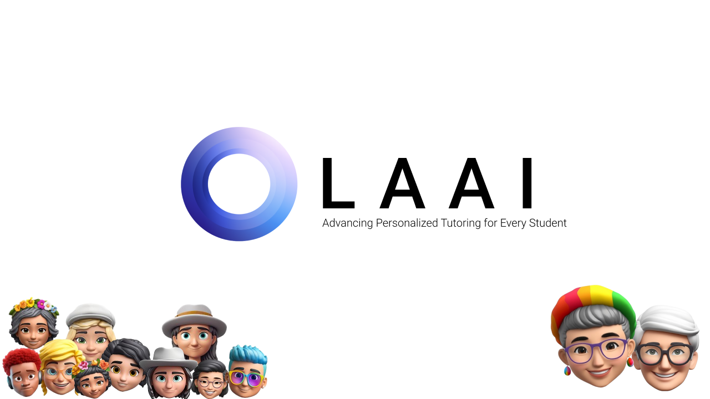

## Hello World 👾

[LAAI](https://laai.com) is at the forefront of **advancing AI systems** to revolutionize personalized learning. Our mission is to empower students by creating intelligent, adaptive tutoring systems that identify weaknesses, provide tailored support, and inspire growth through Socratic-style questioning.

We believe in harnessing the power of AI to make education more accessible, engaging, and effective for learners worldwide.

---

## Get Involved 🤝

We welcome contributions from the community! Whether you're a developer, educator, or AI enthusiast, there are many ways to get involved:  
- **Contribute to our projects**: Check out our [Contributing Guidelines](link-to-contributing-guidelines).  
- **Report issues**: Open an issue in the relevant repository.  
- **Join the discussion**: Participate in our [Slack Channel](https://laaiworkspace.slack.com/archives/C08DELGMMPC).  

Thank you for visiting LAAI! We’re excited to have you on this journey with us. 🚀  